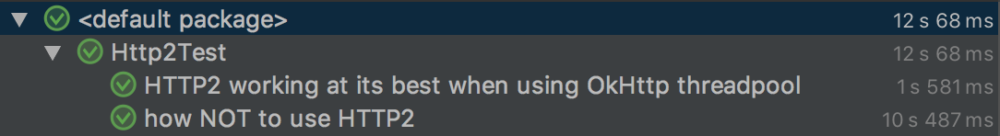

# HTTP/2 Playground with OkHttp

A small playground with unit tests for how to use (and how NOT to use) HTTP/2 with OkHttp. Have a look at the source: [Http2Test.kt](src/test/java/Http2Test.kt)

There is a IntelliJ run config to run the tests:

This is how the test results should look like:

Enjoy!
